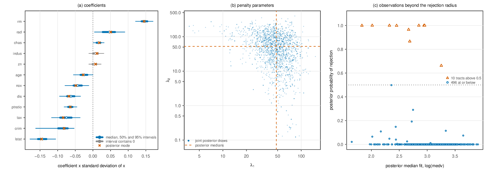
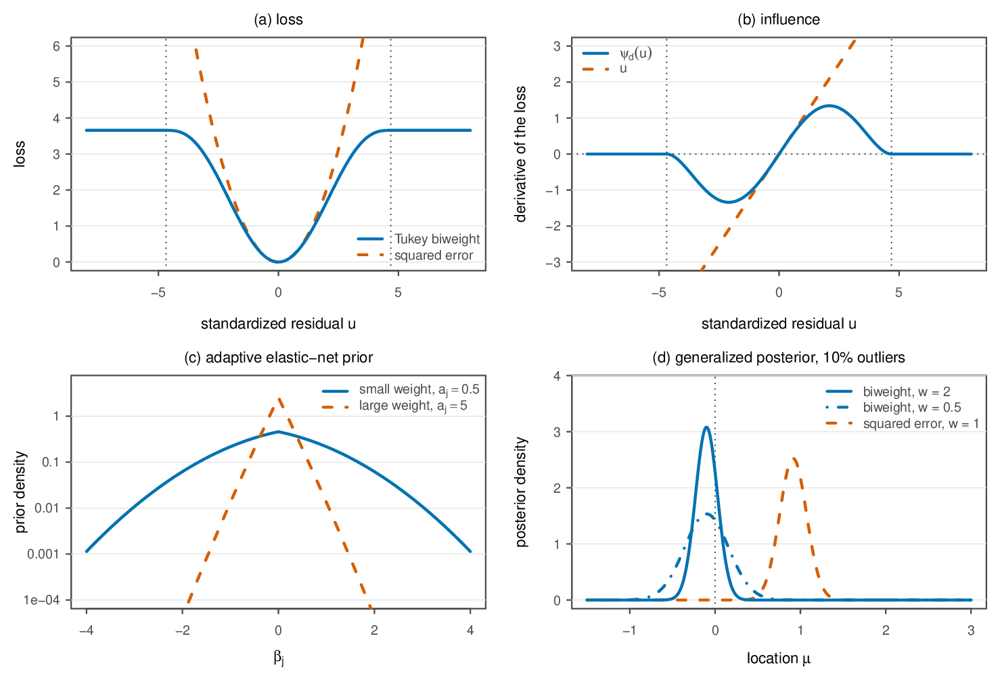
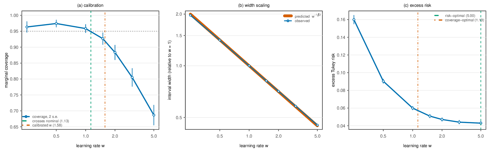
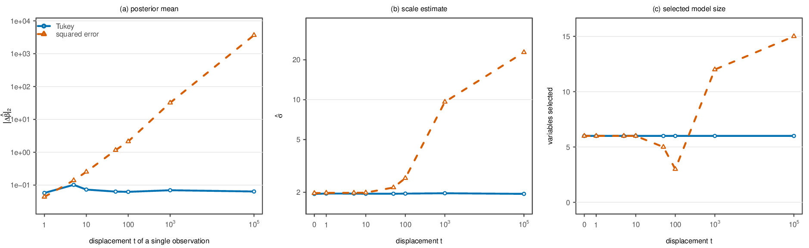
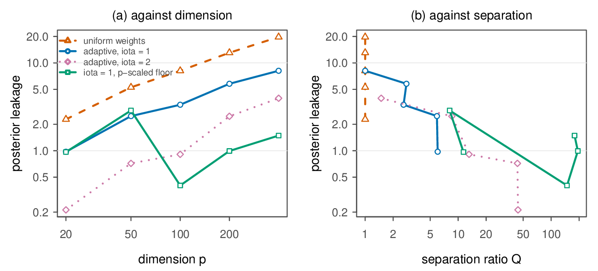
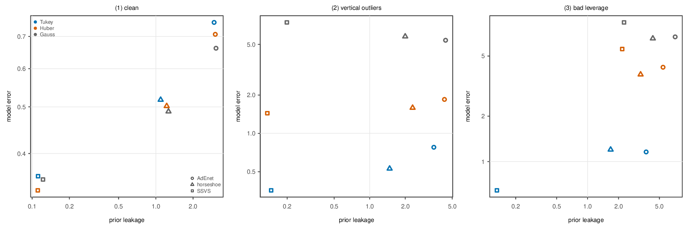
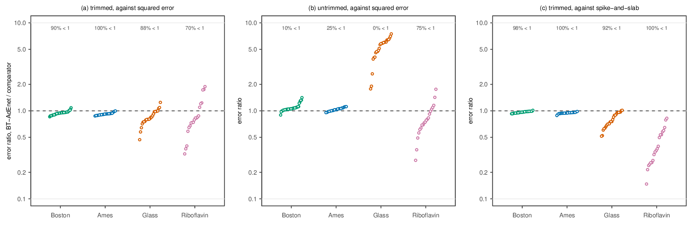
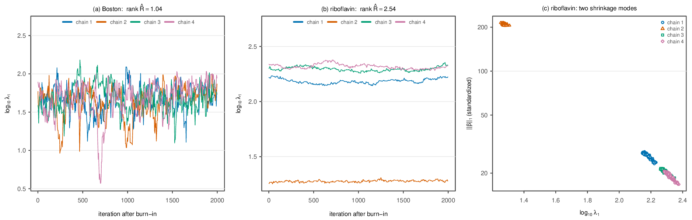

# BT-adEnet

**A Gibbs Posterior for Robust Sparse Regression under a Bounded Loss: Exact
Poisson Augmentation and a Conjugate Sampler**

The Tukey biweight criterion is bounded, so `exp(-Tukey)` is not integrable and
there is no likelihood. The model is therefore a **generalized (Gibbs)
posterior**: the biweight enters as a loss with a calibrated learning rate `w`,
and the adaptive elastic-net penalty is reinterpreted as a proper prior via a
scale mixture of normals. The T-AdEnet estimator is the exact posterior mode, so
every posterior summary describes uncertainty around the frequentist solution.



*Figure 9 — The BT-adEnet posterior on the full Boston data, four chains:
(a) posterior medians with 50% and 95% credible intervals and the posterior
mode, (b) joint posterior draws of `(lambda1, lambda2)`, (c) posterior
probability that each tract lies beyond the rejection radius.*
*(from `R/posterior-fits.R` → `posterior-fits.rds`)*

## Figures

**Figure 3 — Ingredients of the generalized posterior** at `d = 4.685` —
(a) Tukey's loss against squared error and (b) their derivatives, with `±d`
dotted; (c) the prior with `c = 0.5` for a small and a large
`a_j = w·lambda1·w_j`, on a log scale; (d) exact posteriors of a location
from 36 standard normal observations and 4 at 10, with the scale fixed at 1
and a flat prior.



**Figure 4 — Learning-rate calibration.** Coverage (a), interval width (b) and
excess Tukey risk (c) against the learning rate. Bars are two Monte Carlo
standard errors, and the wide line in (b) is the predicted `w^(-1/2)` scaling.
*(from `R/calibration2.R` → `calib2.rds`)*



**Figure 5 — Bounded sensitivity.** Response to one observation displaced by
`t`, medians over replications; blue is Tukey's biweight, orange squared error.
*(from `R/experiments.R`, arm E2 → `e2-sensitivity.rds`)*



**Figure 6 — Prior leakage** against (a) dimension and (b) the separation
ratio `Q`, medians over replications. *(from `R/ratio.R` → `ratio.rds`)*



**Figure 7 — Comparators.** Model error against prior leakage at `p = 100`;
colour shows the loss and shape the prior.
*(from `R/comparators.R` → `comparators.rds`)*



**Figure 8 — Real data.** Prediction error of BT-adEnet divided by that of the
squared-error arm, trimmed (a) and untrimmed (b), and of the spike-and-slab
arm, trimmed (c), one point per split; values below one favour BT-adEnet.
*(from `R/realdata.R` → `realdata.rds`)*



**Figure 9 — Full-data posterior** on Boston, four chains — shown at the top
of this page. *(from `R/posterior-fits.R` → `posterior-fits.rds`)*

**Figure 10 — MCMC diagnostics.** Four chains from dispersed starts on the
full data: traces of `log10(lambda1)` on Boston (a) and riboflavin (b), with
the rank-normalized split R-hat of `lambda1`, and (c) the riboflavin draws of
`lambda1` against the `lambda1`-norm of the standardized coefficients.
*(from `R/posterior-fits.R` → `posterior-fits.rds`)*



## Code

| file | produces | needed for |
|---|---|---|
| `R/bt_adenet.R` | — | Algorithm 1: loss, pilot, T-AdEnet solver, sampler. Every other script `source()`s it |
| `R/validate.R` | `sim-results.rds` | Table 1, `sim*` macros |
| `R/calibration2.R` | `calib2.rds` | Tables 2–3, Figure 4, `cal*` macros |
| `R/experiments.R` | `e2-sensitivity.rds` | Figure 5, `es*` macros (run arm E2; E1/E3/E4 are in the file but superseded) |
| `R/ratio.R` | `ratio.rds` | Table 4, Figure 6 (leakage + weight floor), `ra*` macros |
| `R/diffuse.R` | `diffuse.rds` | diffuse-prior table, `df*` macros |
| `R/comparators.R` | `comparators.rds` | comparator + runtime tables, Figure 7, `cp*` macros |
| `R/frequentist.R` | `frequentist.rds` | the enetLTS column of the comparator table |
| `R/sensitivity.R` | `sensitivity.rds` | sensitivity table, `se*` macros |
| `R/realdata.R` | `realdata.rds`, `realdata-agg.rds` | real-data table, Figure 8, `rd*` macros |
| `R/posterior-fits.R` | `posterior-fits.rds` | Figures 9–10, `pf*` macros |
| `R/tables.R` | the 10 `\input` files | every table |
| `R/figures.R` | the 7 generated PDFs | every figure except the TikZ factor graph, which is inline in the `.tex` |

## Precomputed outputs

All eleven `.rds` outputs in the table above are committed at the repository
root, exactly where the scripts write them. `R/tables.R` and `R/figures.R`
read those files, so the paper's tables and figures can be rebuilt without
rerunning any experiment:

```bash
Rscript R/tables.R
Rscript R/figures.R
```

The rendered figure PDFs are generated by `R/figures.R`; PNG copies for this
README are in [`figures/`](figures/).

## Running

All scripts are run from the repository root, e.g.

```bash
Rscript R/validate.R [nrep] [cores] [largest p to run] [refit 1/0]
Rscript R/calibration2.R [nrep] [nrep_freq] [B] [cores]
Rscript R/experiments.R [which, e.g. "E2"] [nrep] [cores]
Rscript R/ratio.R [nrep] [cores]
Rscript R/diffuse.R [nrep] [cores]
Rscript R/comparators.R [nrep] [cores]
Rscript R/frequentist.R [nrep] [cores]
Rscript R/sensitivity.R [nrep] [cores]
Rscript R/realdata.R [nsplit_1 .. nsplit_4] [cores] [merge]
Rscript R/posterior-fits.R
Rscript R/tables.R
Rscript R/figures.R
```

The sampler in `R/bt_adenet.R` is base R only; `robustbase` is used for the MM
pilot when installed and `p < n/2`, otherwise a self-contained
ridge → Huber → Tukey IRLS pilot is used. The comparator arm additionally uses
`enetLTS`.
